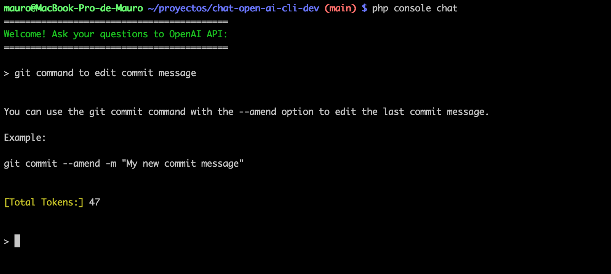
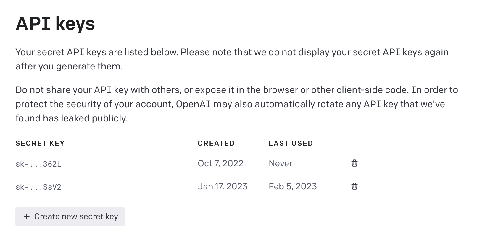

# Chat using OpenAI API from CLI

:robot: Ask questions to OpenAI API using the CLI.



------

## GETTING STARTED:

> **Requires PHP 8.1+**

### Clone repository with git and install dependencies:

In your terminal execute:

```bash
git clone https://github.com/maurobonfietti/chat-open-ai-cli
cd chat-open-ai-cli
cp .env.example .env
composer install
```


### Configure your OpenAI API KEY:

Edit your `.env` file:

```
OPEN_AI_SECRET_API_KEY='Your-Open-AI-Secret-Api-Key-Goes-Here'
```


### Get your API KEY from OpenAI:

Create an account on **OpenAI** to get your **API KEY**.

#### Screenshot from OpenAI Platform:

<p align="left">
    
</p>

------


## USAGE:

Chat to OpenAI from CLI with this command:

```bash
php console chat
```


## OPTIONS:

Use the OpenAI **Codex** model and allow **multiline** with this command:

```bash
php console chat --codex --multiline
```


Get help and more info:

```bash
php console --help
```


Check command version:

```bash
php console --version
```

> *I'm using the alias: `chat` equivalent to: `php console chat`*.

> *and using the alias: `code` equivalent to: `php console chat --codex --multiline`*.


## DEMO:

:video_camera: :movie_camera: See the video on Youtube: [I ask the OpenAI API questions from the CLI.](https://youtu.be/EdU8iwBja5U)


https://user-images.githubusercontent.com/24535949/218822213-936b2266-4c27-475d-9728-80468812b9aa.mp4


## DEPENDENCIES:

- [openai-php/client](https://github.com/openai-php/client): Supercharged community PHP API client that allows you to interact with the Open AI API.
- [symfony/console](https://github.com/symfony/console): The Console component eases the creation of beautiful and testable command line interfaces.
- [vlucas/phpdotenv](https://github.com/vlucas/phpdotenv): Loads environment variables from `.env` to `getenv()`, `$_ENV` and `$_SERVER` automagically.


## CONFIGURE YOUR OPEN AI ACCOUNT:

When you create your account on **OpenAI**, you can get some free credits (like 18 USD on credits -at the time of writing this-). You can set your prefered payment method (Credit Card for instance).

#### Screenshot from OpenAI Platform:

<p align="left">
    
</p>

------

Also, you can set and configure the usage limits (Hard Limit and Soft Limit).

#### Screenshot from OpenAI Platform:


------

#### Screenshot from OpenAI Platform:


------

## LIMITATIONS:

:warning: There is no context or conversation saved. So, each new request is a unique and independent **Q&A** :robot:.


## HELPFUL EXTERNAL LINKS:

https://openai.com/api/pricing/

https://platform.openai.com/tokenizer

https://platform.openai.com/account/usage

https://platform.openai.com/docs/quickstart/adjust-your-settings

https://platform.openai.com/docs/models/finding-the-right-model


## LICENSE:

:page_facing_up: The MIT License (MIT). Please see [License File](LICENSE.md) for more information.

[ico-license]: https://img.shields.io/badge/license-MIT-brightgreen.svg?style=flat


## WOULD YOU LIKE TO SUPPORT THIS PROJECT?

:heart: You can support this project inviting me a coffee :coffee: :yum: or giving a **star** to this repo :star: :blush:.

[](https://ko-fi.com/maurobonfietti)


## THAT'S IT!

:partying_face: Now go and ask interesting questions to **OpenAI API** from the CLI :computer: :robot:.
